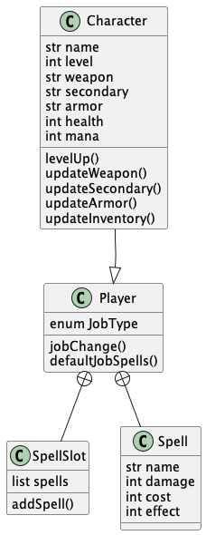

# RPG Saves

# About

This application is WIP.
The intent is to practice creating and testing a basic REST API using Java in a fun manner where users can save DnD characters and their properties.

Data persists on a database such as PostgresSQL or interface with AWS/GCP datawarehouse.

