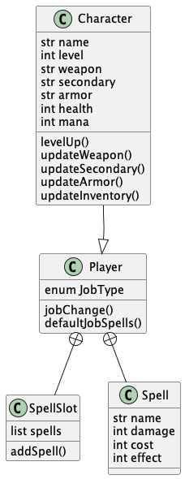

# RPG Saves

## About

This application is WIP. The intent is to practice creating and testing a basic REST API in Java using Spring, Swagger, and Postman.
This application will provide DnD players a management system for their characters and properties.
Data will be saved on a database such as PostgresSQL or will interface with AWS/GCP datawarehouse.

## API Endpoints

Base URL: /player

* Endpoints: (Endpoint, HTTP Method, Description)
    * /player/{id}, GET, Retrieves details of player by unique ID
    * /player/new, POST, Creates new player character
    * /player/{id}/setlevel, PUT, Updates player level
    * /player/{id}/levelup, PUT, Adds 1 player level
    * /player/{id}/weapon, PUT, Updates player primary weapon
    * /player/{id}/secondary, PUT, Updates player secondary weapon
    * /player/{id}/armor, PUT, Updates player armor
    * /player/{id}/spellslot, GET, Retrieves player spell slot details
    * /player/{id}/details, GET, Retrieves full player details (stats, equipment, spells)

## Class Diagram

     
    
     

